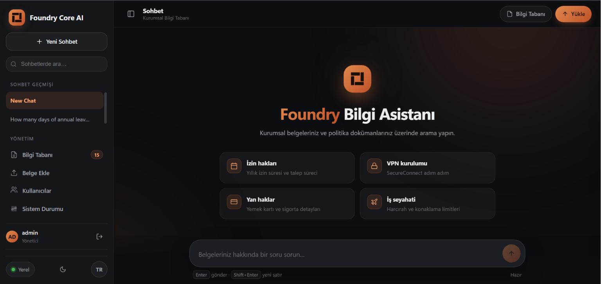
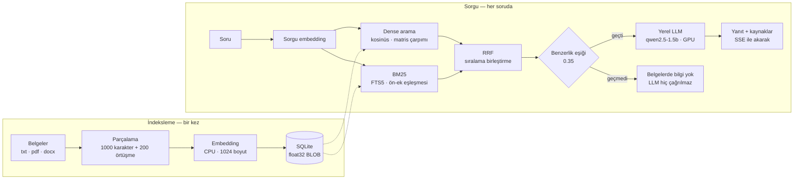

<p align="center">
  
</p>

<h1 align="center">Foundry Core AI</h1>

<p align="center">
  <b>Belgeleriniz cihazdan çıkmadan çalışan kurumsal soru-cevap asistanı.</b><br>
  Microsoft Foundry Local üzerine kurulu, tamamen çevrimdışı Türkçe RAG sistemi.
</p>

<p align="center">
  
  
  
  
  
</p>

<p align="center">
  <a href="#hızlı-başlangıç">Hızlı başlangıç</a> ·
  <a href="#yeni-bir-cihazda-temiz-kurulum">Temiz kurulum</a> ·
  <a href="#donanımınıza-göre-model-seçimi">Model seçimi</a> ·
  <a href="#yapılandırma">Yapılandırma</a> ·
  <a href="#bilinen-sınırlar">Sınırlar</a>
</p>



---

## İçindekiler

- [Ne işe yarar](#ne-işe-yarar)
- [Mimari](#mimari)
- [Hızlı başlangıç](#hızlı-başlangıç)
- [Yeni bir cihazda temiz kurulum](#yeni-bir-cihazda-temiz-kurulum)
- [Belge ekleme ve kullanım](#belge-ekleme-ve-kullanım)
- [Donanımınıza göre model seçimi](#donanımınıza-göre-model-seçimi)
- [Yapılandırma](#yapılandırma)
- [API](#api)
- [Test ve değerlendirme](#test-ve-değerlendirme)
- [Ölçülen performans](#ölçülen-performans)
- [Bilinen sınırlar](#bilinen-sınırlar)
- [Proje yapısı](#proje-yapısı)
- [Belgeler](#belgeler)

---

## Ne işe yarar

Kurumsal iç belgeler — izin politikası, masraf prosedürleri, BT talimatları —
bulut tabanlı bir asistana verilemez. Foundry Core AI aynı deneyimi, veriyi
cihazdan çıkarmadan sunar.

| | |
|---|---|
| **Tamamen yerel** | Model indirildikten sonra internet gerekmez. Dil modeli, embedding modeli, vektör deposu ve arama katmanının tamamı aynı makinede çalışır. |
| **Kaynak gösterir** | Her yanıt hangi belgeden geldiğini bildirir; kullanıcı doğrulayabilir. |
| **Bilmediğini söyler** | Benzerlik eşiğini geçen parça yoksa dil modeli **hiç çağrılmadan** "belgelerde bilgi yok" döner. Hem hızlı hem uydurmaya kapalı. |
| **Türkçeye göre kurulmuş** | Dense arama tek başına sondan eklemeli dilde yetersiz kalır; BM25 ile hibrit çalışır. |
| **Tek dosya** | Harici vektör veritabanı yok. Bilgi tabanı tek bir SQLite dosyasıdır; kopyalanabilir, yedeklenebilir. |

## Mimari



Üç tasarım kararı bu şemayı belirledi:

- **Hibrit arama.** Türkçe sondan eklemelidir; "izin" sorgusu "izinleri" geçen
  parçayı saf dense aramada kaçırıyordu. Dense ve BM25 sonuçları **Reciprocal
  Rank Fusion** ile birleştirilir — skorlar toplanmaz, çünkü kosinüs 0–1
  arasında, BM25 ise sınırsız ve korpusa bağlıdır. RRF yalnızca sıralamaları
  kullandığı için ölçek kalibrasyonu gerektirmez.
  ([ADR-0002](docs/adr/0002-hibrit-arama.md))
- **Eşiğin iki işlevi var.** Gürültü filtresi olmasının yanında, eşiği geçen
  parça yoksa dil modelini hiç çalıştırmaz. Bu hem uydurmayı imkânsız kılar hem
  yanıtı iki kattan fazla hızlandırır.
- **Vektörler SQLite içinde.** 1024 boyutlu bir vektör JSON metni olarak ~20 KB,
  float32 BLOB olarak 4 KB yer kaplar ve `np.frombuffer` ile sıfır ayrıştırma
  maliyetiyle okunur. Tüm embedding'ler bellekte tek bir matriste tutulur;
  benzerlik tek matris çarpımıdır. Bu ölçekte harici bir vektör veritabanının
  kazancı yoktur. ([ADR-0004](docs/adr/0004-vektor-deposu-sqlite.md))

> Kararların tamamı ve reddedilen alternatifler:
> **[Mimari Karar Kayıtları](docs/adr/)** · Terimler: **[Sözlük](docs/glossary.md)**

---

## Hızlı başlangıç

**Windows 10/11, tek komut:**

```powershell
powershell -ExecutionPolicy Bypass -File install.ps1 -PreloadModels
```

Betik Python ve Foundry Local'i doğrular (yoksa `winget` ile kurar), sanal ortamı
oluşturur, bağımlılıkları sabitlenmiş sürümlerle (`requirements.lock`) yükler,
`.env` dosyasını üretir ve **166 testi çalıştırarak kurulumu doğrular**.
`-PreloadModels` modelleri (~2–3 GB) kurulum sırasında indirir.

Sonrasında:

```powershell
start.bat
```

Arayüz: <http://localhost:8000>

---

## Yeni bir cihazda temiz kurulum

Depoyu klonlayıp sıfırdan çalıştırmak isteyenler için adım adım.

### 0. Ön koşullar

| Gereksinim | Değer |
|---|---|
| İşletim sistemi | Windows 10/11 (macOS için aşağıya bakın) |
| Python | 3.11 veya üzeri, PATH'e ekli |
| RAM | 8 GB minimum, 16 GB önerilir |
| Disk | ~15 GB (varsayılan modeller dahil; daha büyük model seçilirse artar) |
| GPU | Zorunlu değil. Varsa yanıt süresi belirgin şekilde kısalır. |
| İnternet | Yalnızca kurulum ve model indirme sırasında |

> **Linux desteklenmiyor.** Foundry Local'in Linux çalışma zamanı bulunmuyor.
> Gerekçe ve yeniden değerlendirme koşulu:
> [ADR-0008](docs/adr/0008-dagitim-stratejisi.md)

### 1. Depoyu alın

```powershell
git clone https://github.com/Erkan3034/foundry-core-ai.git
cd foundry-core-ai
```

### 2. Kurulumu çalıştırın

```powershell
powershell -ExecutionPolicy Bypass -File install.ps1 -PreloadModels
```

Betik idempotenttir: yarıda kalırsa yeniden çalıştırmak güvenlidir.
Son adımda testler geçmezse kurulum eksiktir — çıktıdaki hatayı okuyun.

`-PreloadModels` vermezseniz modeller ilk soruda inecektir; bu, ilk sorunun
dakikalarca sürmesi anlamına gelir. Demo yapacaksanız mutlaka önceden indirin.

### 3. Donanımınıza göre modeli seçin

Varsayılan yapılandırma **2 GB VRAM'li bir dizüstü** için ayarlanmıştır. Daha
güçlü bir makineniz varsa bu adımı atlamayın — bkz.
[Donanımınıza göre model seçimi](#donanımınıza-göre-model-seçimi).

### 4. Belgelerinizi ekleyin

```powershell
# Belgeleri documents\ klasörüne kopyalayın, sonra:
venv\Scripts\python main.py ingest
```

İlk indeksleme, embedding CPU'da üretildiği için yavaştır (yüzlerce parça için
dakikalar sürebilir). Tek seferliktir; sorgu tarafı bundan etkilenmez.

### 5. Başlatın ve doğrulayın

```powershell
start.bat
```

```powershell
venv\Scripts\python main.py stats        # kaç belge, kaç parça, kaçı embed edilmiş
curl http://localhost:8000/health        # servis ayakta mı
```

### Tamamen sıfırdan başlamak

Bozulmuş bir kurulumu temizlemek veya bilgi tabanını sıfırlamak için:

```powershell
Remove-Item knowledge_base.db -ErrorAction SilentlyContinue   # bilgi tabanı
Remove-Item -Recurse -Force venv                              # sanal ortam
Remove-Item -Recurse -Force foundry_local_data                # indirilen modeller (~3 GB)
```

Ardından 2. adımdan devam edin. `.env` dosyanızı korumak istiyorsanız silmeyin;
`install.ps1` mevcut `.env`'i ezmez.

### macOS veya elle kurulum

```bash
brew install microsoft/foundrylocal/foundrylocal
python -m venv venv && source venv/bin/activate
pip install -r requirements.txt
cp .env.example .env
python main.py ingest
python api_server.py
```

---

## Belge ekleme ve kullanım

```bash
python main.py ingest                  # documents/ klasörünü işle
python main.py ingest --path ./belgeler # başka bir dizini işle
python main.py ingest --force          # işlenmiş dosyaları yeniden işle
python main.py stats                   # bilgi tabanı istatistikleri
python main.py                         # etkileşimli CLI
python api_server.py                   # web arayüzü + REST API
```

**Desteklenen formatlar:**
`.txt` `.md` `.pdf` `.docx` `.xlsx` `.pptx` `.py` `.js` `.html` `.css` `.json`
`.xml` `.csv` `.log` `.rst`

Belgeler web arayüzündeki **Belge Ekle** ekranından da yüklenebilir.

---

## Donanımınıza göre model seçimi

Varsayılanlar 2 GB VRAM'li bir GeForce MX450 üzerinde ayarlandı. Bu, projenin
mimari bir tercihi değil, **donanıma bağlı bir varsayılandır**
([ADR-0003](docs/adr/0003-model-cihaz-dagilimi.md)). Daha güçlü bir makinede
model büyütmek, ölçülen zayıflıkların asıl çözümüdür.

### Öneri tablosu

| VRAM | Chat modeli | Model boyutu | Embedding cihazı | Not |
|---|---|---|---|---|
| 2–4 GB | `qwen2.5-1.5b` | 1.8 GB | `generic-cpu` | Mevcut varsayılan. İki model aynı anda VRAM'e sığmaz. |
| 8 GB | `qwen2.5-7b` | 6.2 GB | `generic-cpu` | **Önerilen.** Aynı model ailesi, ~4 kat parametre; prompt davranışı benzer kalır. |
| 16 GB+ | `qwen2.5-14b` | 11.1 GB | `auto` | Katalogdaki en iyi Türkçe kalitesi. Embedding de GPU'ya alınabilir. |

Modelin VRAM'e sığmaması hata vermez; Foundry Local modeli CPU'ya alır ve sistem
çalışmaya devam eder, yalnızca belirgin şekilde yavaşlar. Bu yüzden tablodaki
VRAM değerleri bir alt sınır değil, **akıcı çalışma eşiğidir**. Disk tarafında
model boyutu kadar ek yer gerekir.

**Kaçınılması gerekenler:**

| Model | Neden |
|---|---|
| Adında `reasoning` geçenler (`phi-4-reasoning`, `deepseek-r1-*`) | Yanıttan önce `<think>` bloğu üretir; token bütçesini tüketip **boş yanıt** döndürür ([ADR-0001](docs/adr/0001-chat-modeli-secimi.md)) |
| `qwen3-*` serisi | Aynı düşünme bloğu riski |
| `phi-*` genel olarak | Türkçe kalitesi zayıf |
| `coder` / `vl` varyantları | Farklı görev için eğitilmiş |

Katalogdaki tüm modelleri, boyutlarını ve indirilmiş olup olmadıklarını görmek
için:

```bash
foundry model list
```

### Nasıl değiştirilir

`.env` dosyasında iki satır:

```ini
CHAT_MODEL_ALIAS=qwen2.5-7b
EMBEDDING_DEVICE=generic-cpu     # 8 GB+ VRAM varsa: auto
```

Ardından yeni modeli indirin ve servisi yeniden başlatın:

```powershell
powershell -ExecutionPolicy Bypass -File install.ps1 -PreloadModels
start.bat
```

### Model değiştirdikten sonra ölçün — bu adım atlanmamalı

Mevcut sistem promptu 1.5B modelin davranışına göre ayarlandı. Bu projede
ölçülen bazı bulgular (örneğin *"prompt'a kural eklemek kaliteyi düşürüyor"*)
**küçük modele özgü olabilir**; 7B'de tersine dönebilir. Varsaymayın, ölçün:

```bash
python benchmark.py         # hız: TTFT, token/sn (makine boşken çalıştırın)
python eval/run_eval.py     # kalite: eval/RESULTS.md
```

Karşılaştırma tabanı `eval/RESULTS.md` içinde. Özellikle `tuzak` kategorisine
bakın: 1.5B'de 0/3. Bu sayı yükseldiyse büyük model işe yaramış demektir —
beklenen asıl kazanç oradadır.

> **Embedding modelini değiştirirseniz** (`EMBEDDING_MODEL_ALIAS`) mevcut
> vektörler geçersiz hale gelir; farklı modellerin vektörleri karşılaştırılamaz.
> Bilgi tabanını yeniden kurun: `python main.py ingest --force`

---

## Yapılandırma

Tüm değerler `.env` üzerinden okunur; aşağıdaki varsayılanlar `config.py` ile
birebir aynıdır.

### Model ve cihaz

| Değişken | Açıklama | Varsayılan |
|---|---|---|
| `CHAT_MODEL_ALIAS` | Chat modeli (instruct önerilir) | `qwen2.5-1.5b` |
| `EMBEDDING_MODEL_ALIAS` | Embedding modeli | `qwen3-embedding-0.6b` |
| `CHAT_DEVICE` | Chat modeli varyantı | `auto` |
| `EMBEDDING_DEVICE` | Embedding varyantı | `generic-cpu` |
| `MODEL_CACHE_DIR` | Model önbellek dizini | `./foundry_local_data/model_cache` |

### Arama ve RAG

| Değişken | Açıklama | Varsayılan |
|---|---|---|
| `TOP_K_RETRIEVAL` | Modele gönderilecek parça sayısı | `3` |
| `MIN_SIMILARITY` | Benzerlik eşiği; altındakiler elenir | `0.35` |
| `USE_HYBRID_SEARCH` | Dense + BM25 hibrit arama | `true` |
| `HYBRID_POOL_FACTOR` | Füzyon havuzu = `top_k` × bu | `5` |
| `KEYWORD_RESCUE_RATIO` | Kelime eşleşen parçalar için eşik çarpanı | `0.75` |
| `CHUNK_SIZE` / `CHUNK_OVERLAP` | Parça boyutu / bindirme (karakter) | `1000` / `200` |
| `MAX_CONTEXT_LENGTH` | Modele giden toplam bağlam limiti | `4000` |

> `MAX_CONTEXT_LENGTH` yalnızca bir kalite ayarı değildir. Ölçümde bağlam
> uzunluğu ilk token süresinin **birinci dereceden belirleyicisi** çıktı:
> 0 karakterde 4.1 sn, 2144 karakterde 16.8 sn. Yavaşlıktan şikâyet varsa
> düşürülecek ilk parametre budur.

### Üretim

| Değişken | Açıklama | Varsayılan |
|---|---|---|
| `MAX_TOKENS` | Yanıt uzunluk limiti | `1024` |
| `TEMPERATURE` | Örnekleme sıcaklığı | `0.35` |
| `FREQUENCY_PENALTY` | Tekrar cezası (0 = kapalı) | `0.0` |

> `FREQUENCY_PENALTY` bilinçli olarak kapalıdır. Tekrar döngüleri artık örnekleme
> ayarıyla değil, üretim sırasında deterministik tespitle kesilir; gerekçesi
> [ADR-0007](docs/adr/0007-tekrar-dongusu-savunmasi.md)'de.

### Sunucu

| Değişken | Açıklama | Varsayılan |
|---|---|---|
| `API_HOST` | Sunucu adresi | `127.0.0.1` |
| `API_PORT` | Port | `8000` |
| `DATABASE_PATH` | Bilgi tabanı dosyası | `knowledge_base.db` |
| `LOG_LEVEL` | Günlük seviyesi | `info` |

> `API_HOST=0.0.0.0` yapılırsa servis tüm ağ arayüzlerine açılır ve açılışta
> uyarı basar. Bu durumda **önüne TLS sonlandıran bir ters vekil (nginx/Caddy)
> koymak şarttır**; düz HTTP'de trafik ağda açık metin gider
> ([ADR-0006](docs/adr/0006-ag-erisimi-ve-tasima-guvenligi.md)).

---

## API

```bash
# Servis durumu
curl http://localhost:8000/health

# Sorgu
curl -X POST http://localhost:8000/query \
  -H "Content-Type: application/json" \
  -H "Authorization: Bearer <token>" \
  -d '{"query": "Yıllık izin kaç gün?"}'
```

Yanıt gövdesi, üretilen metnin yanında `sources` alanında kaynak belgeleri
döndürür. Streaming uç noktası Server-Sent Events kullanır.

---

## Test ve değerlendirme

Bu projede **iki ayrı şey** ölçülür ve ikisi birbirinin yerine geçmez:

```bash
pytest                    # Kod doğru mu?      -> 166 test
python eval/run_eval.py   # Yanıtlar doğru mu? -> eval/RESULTS.md
```

Birim testi kodun sözleşmesini doğrular; modelin davranışını doğrulamaz. Bir RAG
sisteminde değerlendirme seti opsiyonel bir ekstra değil, testlerle eşit ağırlıkta
ikinci bir disiplindir.

`eval/` dört kategoride soru içerir:

| Kategori | Ne ölçüyor | Son sonuç |
|---|---|---|
| `cevaplanabilir` | Belgedeki bilgiyi doğru kaynakla bulabiliyor mu | 11 / 12 |
| `cevaplanamaz` | Belgede olmayan bilgiyi **uydurmuyor** mu | 3 / 4 |
| `tuzak` | Anahtar kelimesi geçen ama cevabı olmayan soruyu reddediyor mu | 0 / 3 |
| `kenar_durum` | Boş / bozuk / aşırı genel girdide çökmüyor mu | geçti |
| | **Genel** | **%74** |

Yöntem ve bulgular: **[eval/README.md](eval/README.md)** ·
Ham sonuçlar: [eval/RESULTS.md](eval/RESULTS.md)

## Ölçülen performans

`python benchmark.py` · GeForce MX450 · 2 GB VRAM · embedding CPU'da · boş
sistem · iki bağımsız koşuda tekrarlandı.

| Ölçüm | Sonuç |
|---|---|
| Vektör arama | 0.047 ms/sorgu (21.300 sorgu/sn) |
| Sorgu embedding + arama | ~1.6 sn |
| İlk token süresi (TTFT) | 15.4 sn |
| Üretim hızı | 19 token/sn |
| Medyan toplam yanıt | 15.5 sn |
| Eşik altı ("bilgi yok") yanıt | 6.7 sn |

Yanıt süresinin dağılımı sezgiye aykırıdır: 15.4 saniyelik ilk token süresinin
yalnızca ~1 saniyesi üretimdir, geri kalanı prompt işleme (prefill). Darboğaz
decode değil prefill olduğu için **streaming algılanan hıza neredeyse hiçbir şey
katmaz**. Bu ölçümün mimari sonuçları
[docs/ogrenilenler.md](docs/ogrenilenler.md) içinde.

---

## Bilinen sınırlar

Bu bölüm bilinçli olarak dürüsttür; her madde bir tasarım takasının sonucudur.

- **Uydurma tamamen çözülmüş değil.** Belgede hiç geçmeyen konularda sistem artık
  doğru şekilde reddediyor. Ancak getirilen parça konuyla **ilgili ama cevabı
  içermiyorsa** model boşluğu doldurabiliyor (ölçülen: `tuzak` kategorisi 0/3).
  Bunun bir eşik değeriyle kapatılamamasının sebebi ölçülmüş ve
  [eval/README.md](eval/README.md) içinde yazılı: benzerlik skoru,
  cevaplanabilirliğin göstergesi değil.
- **Yanıt kalitesi model boyutuyla sınırlı.** 1.5B model çok adımlı çıkarım
  gerektiren sorularda zayıf kalır; aynı cümledeki iki sayıdan yanlışını
  seçebilir. Asıl çözüm daha güçlü donanımda daha büyük model
  ([ADR-0001](docs/adr/0001-chat-modeli-secimi.md)).
- **Ölçek.** Tüm embedding vektörleri RAM'de tutulur; bellek kullanımı parça
  sayısıyla doğrusal artar. Binlerce parça için uygundur, yüz binlerce parçalı
  bir koleksiyon için yaklaşım yeniden değerlendirilmelidir
  ([ADR-0004](docs/adr/0004-vektor-deposu-sqlite.md)).
- **Taşıma güvenliği uygulamada değil.** Varsayılan `127.0.0.1`'de sorun yok; ağ
  erişimi için önüne TLS sonlandıran ters vekil şart
  ([ADR-0006](docs/adr/0006-ag-erisimi-ve-tasima-guvenligi.md)).
- **Tekrar döngüleri önlenmiyor, kesiliyor.** Döngü yakalandığında kullanıcı yarım
  kalmış bir yanıt görebilir; ayrıca tespit şu an yalnızca streaming yolunda var
  ([ADR-0007](docs/adr/0007-tekrar-dongusu-savunmasi.md)).
- **Düşük VRAM'de ilk indeksleme yavaş.** Embedding CPU'ya alındığı için;
  sorgu tarafı etkilenmez ([ADR-0003](docs/adr/0003-model-cihaz-dagilimi.md)).
- **Değerlendirme seti küçük (23 soru)** ve aynı zamanda ayar setidir. Kalibrasyon
  yaparken bu sete ezberletme riski vardır; ayrı bir doğrulama seti henüz yok.

---

## Proje yapısı

```
config.py          Merkezi yapılandırma (tek kaynak)
database.py        SQLite katmanı — parçalar, vektörler, FTS5 indeksi
embeddings.py      Foundry Local embedding + vektörleştirilmiş benzerlik
ingestion.py       Belge okuma → parçalama → embedding → kayıt
retriever.py       Hibrit arama, eşik uygulaması, bağlam oluşturma
search_fusion.py   Reciprocal Rank Fusion
search_text.py     BM25 anahtar kelime araması + Türkçe normalizasyon
rag_engine.py      RAG hattı, streaming üretim, döngü koruması
api_server.py      FastAPI REST API + web arayüzü sunumu
main.py            CLI (ingest, stats, etkileşimli mod)
benchmark.py       Gecikme / TTFT / token-per-second ölçümü
web_ui/            Web arayüzü (koyu tema, TR/EN)
tests/             166 birim ve entegrasyon testi
eval/              Yanıt kalitesi değerlendirme seti ve koşucusu
docs/adr/          Mimari karar kayıtları
install.ps1        Doğrulamalı, idempotent kurulum betiği
```

## Belgeler

| Belge | İçerik |
|---|---|
| [docs/adr/](docs/adr/) | Mimari karar kayıtları — ne, neden, hangi alternatif reddedildi |
| [docs/ogrenilenler.md](docs/ogrenilenler.md) | Nerede zorlanıldı, nerede yanılındı, ne öğrenildi — ölçümlere dayalı teknik bulgular |
| [docs/prod-hazirlik.md](docs/prod-hazirlik.md) | Prod-hazırlık denetimi: hangi senaryoda hazır, hangisinde değil |
| [docs/dagitim.md](docs/dagitim.md) | Firma teslimi, yedekleme ve güncelleme akışı |
| [docs/glossary.md](docs/glossary.md) | Terim sözlüğü |
| [eval/README.md](eval/README.md) | Değerlendirme yöntemi ve kalibrasyon disiplini |

---

## Yazar

**Erkan Turgut**

Microsoft Summer School kapsamında, tek kişilik bir proje olarak geliştirildi.
Mimari kararların tamamı, ölçümler ve kabul edilen takaslar
[docs/adr/](docs/adr/) ve [docs/ogrenilenler.md](docs/ogrenilenler.md) içinde
kayıtlıdır.

[](https://github.com/Erkan3034)

Soru, hata bildirimi ve öneriler için
[issue açabilirsiniz](https://github.com/Erkan3034/foundry-core-ai/issues).

---

<p align="center">
  <sub>© 2026 Erkan Turgut · Apache License 2.0 · <a href="LICENSE">LICENSE</a> · <a href="NOTICE">NOTICE</a></sub>
</p>
