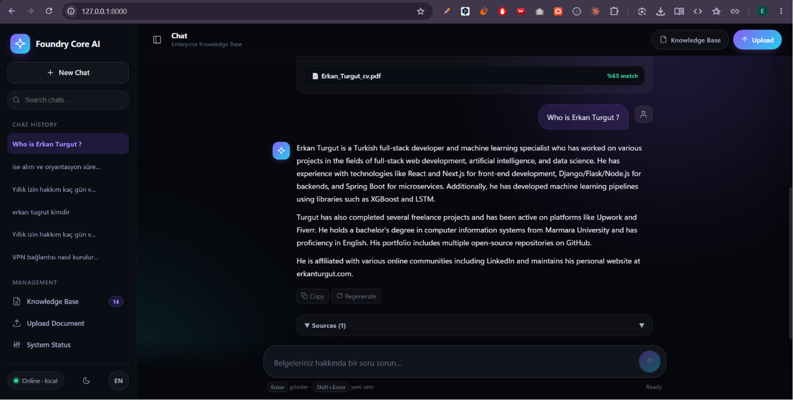

# Foundry RAG Assistant

Yerel belgeleriniz uzerinde soru-cevap yapan, **internet baglantisi gerektirmeyen**
kurumsal AI asistani. Belgeler de, embedding modeli de, dil modeli de cihazda
calisir; hicbir veri disari cikmaz.

Microsoft Foundry Local uzerine kurulmustur.



## Neden

Kurumsal ic belgeler (izin politikasi, masraf prosedurleri, BT talimatlari)
bulut tabanli bir asistana verilemez. Bu proje ayni deneyimi, veriyi cihazdan
cikarmadan sunar:

- **Tamamen yerel** - model indirildikten sonra internet gerekmez
- **Kaynak gosterir** - her yanit hangi belgeden geldigini `[Kaynak: dosya_adi]`
  olarak belirtir, kullanici dogrulayabilir
- **Bilmedigini soyler** - benzerlik esigini gecen parca yoksa dil modeli **hic
  cagrilmadan** "belgelerde bilgi yok" doner. Hem hizli hem uydurmaya kapali.

## Mimari

```
Kullanici sorusu
      |
      v
[Web UI / CLI] ---> [FastAPI + oturum dogrulama]
                          |
                          v
                 [Retriever]  dense (embedding) + BM25
                          |    -> RRF ile birlestirme
                          v
                 [SQLite]  parcalar + vektorler (RAM onbellekli)
                          |
                          |  esigi gecen parca yoksa: LLM'e HIC gidilmez
                          v
                 [Foundry Local LLM]  cihaz uzerinde uretim
                          |
                          v
                  Yanit + kaynaklar (SSE ile akarak)
```

Neden bu sekilde kuruldugu: **[Mimari Karar Kayitlari (ADR)](docs/adr/)**
Terimler: **[Sozluk](docs/glossary.md)**

## Kurulum

**Gereksinimler:** Python 3.11+, Windows 10/11 / macOS 13+ / Linux, 8 GB+ RAM
(16 GB onerilir), ~10-15 GB disk.

```bash
# 1. Foundry Local CLI
winget install Microsoft.FoundryLocal        # Windows
brew install microsoft/foundrylocal/foundrylocal   # macOS
foundry --version                            # dogrula

# 2. Python ortami
python -m venv venv
venv\Scripts\activate                        # Windows
source venv/bin/activate                     # macOS/Linux
pip install -r requirements.txt

# 3. Yapilandirma
cp .env.example .env                         # varsayilanlar calisir durumda
```

## Kullanim

```bash
# Belgeleri documents/ klasorune koyun, sonra:
python main.py ingest

# Web arayuzu (arayuz sunucu tarafindan sunulur)
python api_server.py     # -> http://localhost:8000

# Veya CLI
python main.py
```

Ilk calistirmada `admin` hesabi **rastgele bir parola ile** olusturulur ve
loglara yazilir. Sabit varsayilan parola bilincli olarak kullanilmamistir.

Desteklenen formatlar: `.txt` `.md` `.pdf` `.docx` `.xlsx` `.pptx` `.py` `.js`
`.html` `.css` `.json` `.xml` `.csv` `.log` `.rst`

### API

```bash
curl http://localhost:8000/health
curl -X POST http://localhost:8000/query \
  -H "Content-Type: application/json" \
  -H "Authorization: Bearer <token>" \
  -d '{"query": "Yillik izin kac gun?"}'
```

Okuma yollari giris yapmis her kullaniciya; belge yukleme, silme ve sifirlama
yalnizca `admin` rolune aciktir.

## Yapilandirma

Tum degerler `.env` uzerinden; asagidaki varsayilanlar `config.py` ile birebir
aynidir.

| Degisken | Aciklama | Varsayilan |
|---|---|---|
| `EMBEDDING_MODEL_ALIAS` | Embedding modeli | `qwen3-embedding-0.6b` |
| `CHAT_MODEL_ALIAS` | Chat modeli (instruct onerilir) | `qwen2.5-1.5b` |
| `EMBEDDING_DEVICE` | Embedding varyanti | `generic-cpu` |
| `CHAT_DEVICE` | Chat model varyanti | `auto` |
| `API_HOST` | Sunucu host | `127.0.0.1` |
| `API_PORT` | Sunucu port | `8000` |
| `DATABASE_PATH` | Bilgi tabani dosyasi | `knowledge_base.db` |
| `AUTH_DB_PATH` | Hesap veritabani (ayri dosya) | `auth.db` |
| `SESSION_TTL_HOURS` | Oturum omru | `12` |
| `TOP_K_RETRIEVAL` | Modele gonderilecek parca sayisi | `3` |
| `MIN_SIMILARITY` | Benzerlik esigi; altindakiler elenir | `0.35` |
| `USE_HYBRID_SEARCH` | Dense + BM25 hibrit arama | `true` |
| `HYBRID_POOL_FACTOR` | Fuzyon havuzu = `top_k` x bu | `5` |
| `KEYWORD_RESCUE_RATIO` | Kelime eslesen parcalar icin esik carpani | `0.75` |
| `CHUNK_SIZE` / `CHUNK_OVERLAP` | Parca boyutu / bindirme (karakter) | `1000` / `200` |
| `MAX_CONTEXT_LENGTH` | Modele giden toplam baglam limiti | `4000` |
| `MAX_TOKENS` | Yanit uzunluk limiti | `1024` |
| `TEMPERATURE` | Ornekleme sicakligi | `0.35` |
| `FREQUENCY_PENALTY` | Tekrar cezasi (0 = kapali) | `0.0` |

> `FREQUENCY_PENALTY` varsayilan olarak kapalidir. Tekrar donguleri artik
> ornekleme ayariyla degil, uretim sirasinda deterministik tespitle kesilir -
> gerekcesi icin bkz. [ADR-0007](docs/adr/0007-tekrar-dongusu-savunmasi.md).

## Test ve degerlendirme

Iki ayri sey olculur:

```bash
pytest tests/            # Kod dogru mu?      -> 155 test
python eval/run_eval.py  # Yanitlar dogru mu? -> eval/RESULTS.md
```

`eval/` klasoru dort kategoride soru icerir:

| Kategori | Ne olcuyor |
|---|---|
| `cevaplanabilir` | Belgedeki bilgiyi dogru kaynakla bulabiliyor mu |
| `cevaplanamaz` | Belgede olmayan bilgiyi **uydurmuyor** mu |
| `tuzak` | Anahtar kelimesi belgede gecen ama cevabi olmayan soruyu reddediyor mu |
| `kenar_durum` | Bos / bozuk / asiri genel girdide cokmuyor mu |

Son olcum (23 soru):

| Kategori | Gecti |
|---|---|
| cevaplanabilir | 11 / 12 |
| cevaplanamaz | 3 / 4 |
| tuzak | 0 / 3 |
| **Genel** | **%74** |

Bu olcumun bulgusu ve neyin duzeltildigi: **[eval/README.md](eval/README.md)**
Ham sonuclar: [eval/RESULTS.md](eval/RESULTS.md)

Performans olcumu (arama gecikmesi, TTFT, TPS): `python benchmark.py`

## Bilinen sinirlar

Bu bolum bilincli olarak durustur; her biri bir tasarim takasinin sonucudur.

- **Olcek.** Tum embedding vektorleri RAM'de tutulur; bellek kullanimi parca
  sayisiyla dogrusal artar. Binlerce parca icin uygundur, yuz binlerce parcali
  bir koleksiyon icin yaklasim yeniden degerlendirilmelidir
  ([ADR-0004](docs/adr/0004-vektor-deposu-sqlite.md)).
- **Uydurma tamamen cozulmus degil.** Belgede hic gecmeyen konularda sistem
  artik dogru sekilde reddediyor. Ancak getirilen parca konuyla **ilgili ama
  cevabi icermiyorsa** model hala bosluğu doldurabiliyor (olculen: `tuzak`
  kategorisi 0/3). Bu gizlenmiyor, olculuyor - bkz. [eval/README.md](eval/README.md).
- **Yanit kalitesi model boyutuyla sinirli.** 1.5B model, cok adimli cikarim
  gerektiren sorularda zayif kalir ([ADR-0001](docs/adr/0001-chat-modeli-secimi.md)).
- **Tasima guvenligi uygulamada degil.** Varsayilan `127.0.0.1`'de sorun yok.
  Ag uzerinden erisim icin `API_HOST=0.0.0.0` kullanilacaksa **onunde TLS
  sonlandiran bir ters vekil sart**; duz HTTP'de parolalar ve oturum token'lari
  acik metin gider ([ADR-0006](docs/adr/0006-ag-erisimi-ve-tasima-guvenligi.md)).
- **Tekrar donguleri onlenmiyor, kesiliyor.** Dongu yakalandiginda kullanici
  yarim kalmis bir yanit gorebilir. Ayrica tespit su an yalnizca streaming
  yolunda var ([ADR-0007](docs/adr/0007-tekrar-dongusu-savunmasi.md)).
- **Dusuk VRAM'de ingestion yavas.** Embedding CPU'ya alindigi icin ilk belge
  alimi uzun surer; sorgu tarafi etkilenmez
  ([ADR-0003](docs/adr/0003-model-cihaz-dagilimi.md)).
- **Kaynak gosterimi model davranisina bagli.** Sistem promptu `[Kaynak: ...]`
  eklemesini soyler ama cikti bicimi zorlanmaz; yanlis bicimde donebilir.
  API yaniti `sources` alanini ayrica dondurur, arayuz bunu kullanir.

## Proje yapisi

```
config.py         Merkezi yapilandirma
database.py       SQLite katmani (parcalar, vektorler, anahtar kelime aramasi)
embeddings.py     Foundry Local embedding + vektorlestirilmis benzerlik
ingestion.py      Belge okuma -> parcalama -> embedding -> kayit
retriever.py      Dense + BM25 hibrit arama, esik ve baglam olusturma
search_fusion.py  Reciprocal Rank Fusion
search_text.py    BM25 anahtar kelime aramasi
rag_engine.py     RAG pipeline + streaming uretim + dongu korumasi
auth.py           Oturum, roller, denetim kaydi
password.py       scrypt parola hash'leme
api_server.py     FastAPI REST API
main.py           CLI
web_ui/           Web arayuzu (dark tema, i18n, oturum yonetimi)
tests/            155 birim/entegrasyon testi
eval/             Yanit kalitesi degerlendirme seti ve kosucusu
docs/adr/         Mimari karar kayitlari
docs/glossary.md  Terim sozlugu
benchmark.py      Gecikme / TTFT / TPS olcumu
```

## Lisans

MIT
